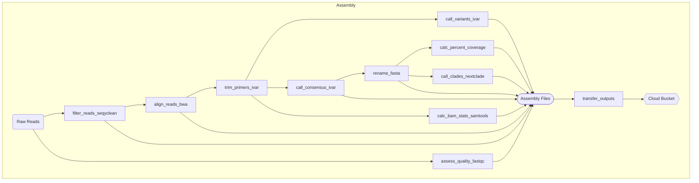
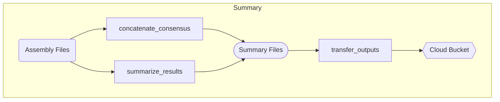

# CDPHE-RSV

This repository contains in development files for a pipeline to process RSV sequence data and summarize their data.

## Limitations

The current in dev version only takes paired-end (PE) reads.

> Next generation sequencing and bioinformatic and genomic analysis at CDPHE is not CLIA validated at this time. These workflows and their outputs are not to be used for diagnostic purposes and should only be used for public health action and surveillance purposes. CDPHE is not responsible for the incorrect or inappropriate use of these workflows or their results.

## Workflow

